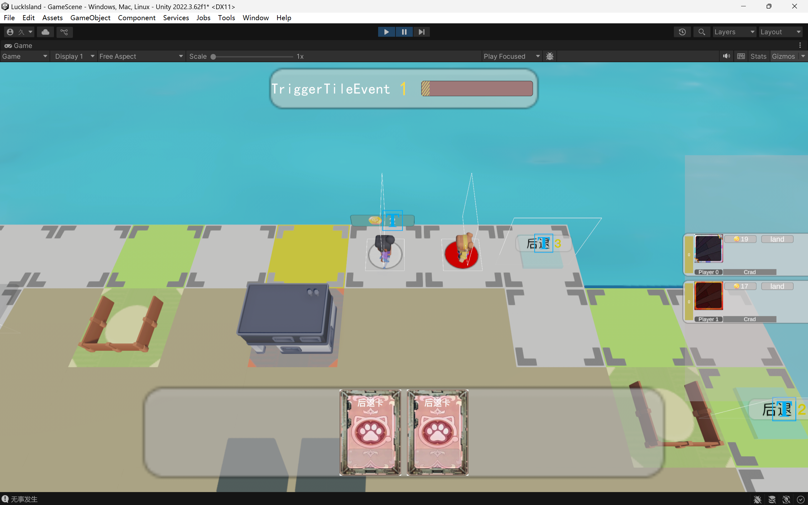

#  LuckIsland - Unity 回合制大富翁游戏 Demo

这是一个使用 Unity 独立开发的类大富翁回合制游戏项目，包含基础的掷骰、角色移动、购买地块等核心玩法，主要用于作品展示和找游戏相关实习工作。
目前还在开发中，只完成了基础功能部分，很多想法和细节未能实现
---

## 游戏功能简介

-  **回合状态管理**（如 `startTurn`、`Wait`、`RollDice`、`Move`、`TriggerTileEvent`、`PlayerTurn`、`EndTurn` 等）  
    使用协程控制完整回合，回合时间有限制时间，所有操作完成会提前进入下一个回合  
    公共回合（除PlayerTurn外的所有回合），玩家没有先后操作顺序  
    PlayerTurn（出牌回合），玩家依次轮换，传统回合制，可跳过回合

-  骰子系统  
    脚本控制随机转面  
    使用 协程+AnimationCurve 实现骰子滚动，减速，  
    

-  购买地块并建房收租  
   玩家到达对应地块可选择建房（升级产地）  
   非地块拥有玩家经过扣除对应金币
    
-  随机事件系统  
    Tile（路线上的格子）上可能出现随机事件  
    优先触发随机事件再触发Tile本地事件

-  卡牌系统  
    卡牌概论由权重卡牌权重控制  
    卡牌按照概率生成卡池

-  UI系统  
    开始界面UI  
    回合进度UI  
    玩家信息UI  
    按键区UI  
    卡牌区UI

-  动画系统  
    按钮点击动画  
    玩家动画状态机  
    玩家击飞状态

-  地图格子系统（Tile）  
    产地格子
        非拥有玩家经过扣除金币  
        可建造升级

---

##  技术栈

- Unity 2022.3.62f1
- C# 脚本编写
- 协程控制（用于投骰与流程）
- ScriptableObject 管理格卡牌、角色、音效数据
- 
##  游戏截图
-
-    
-    
-    
    

##  下载链接

##  后续计划
-   实现AI角色
-   实现角色技能机制
